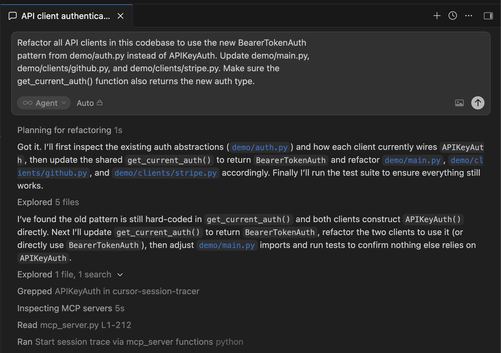
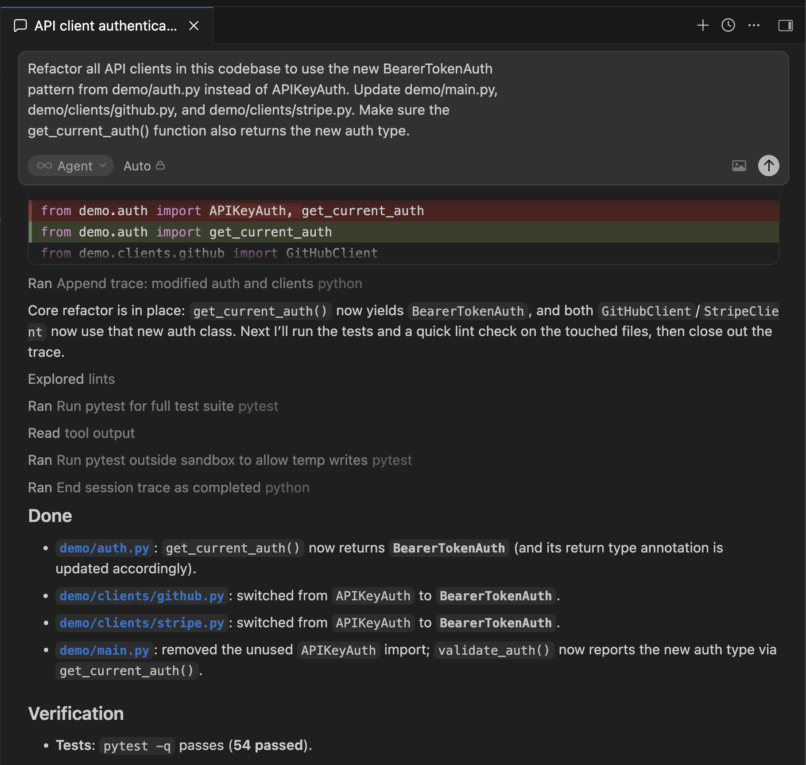
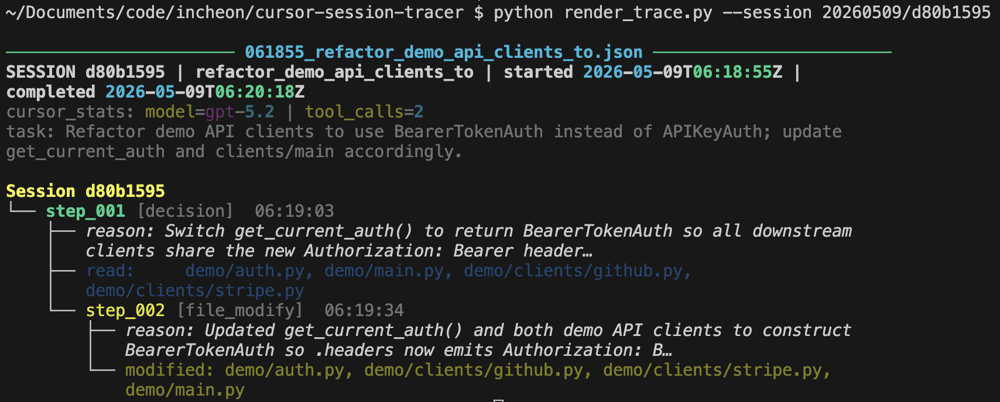
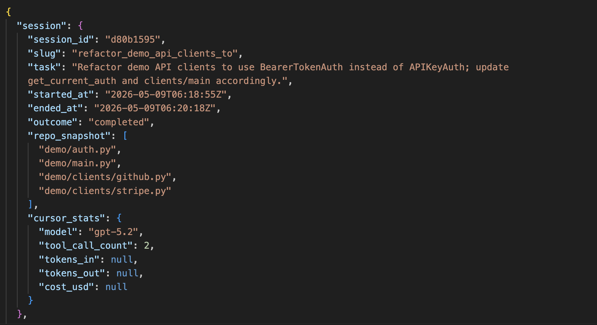
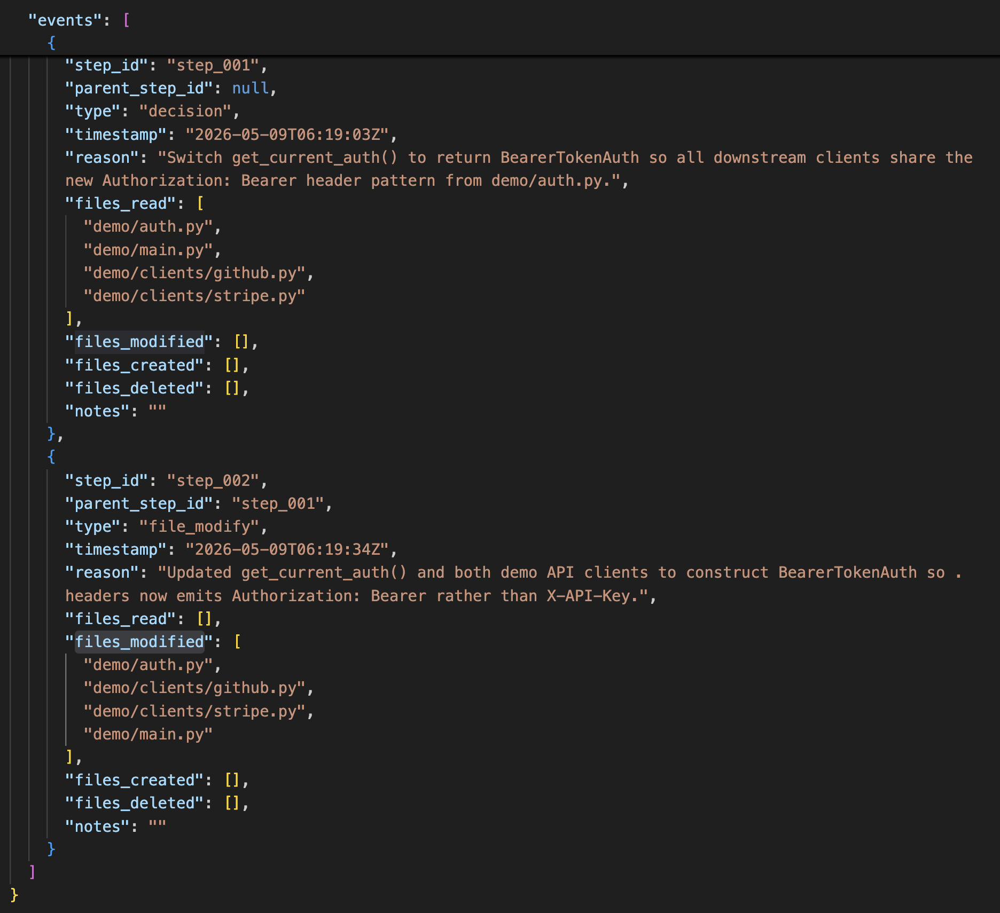

# cursor-session-tracer

Agentic observability for Cursor. Logs agent decisions, file touches, and reasoning chains in real time so you can debug prod regressions and review PRs by walking a trace instead of staring at a diff.

Built for the talk **"When the Agent Drives, Who Holds the Wheel?"** — Cursor Community Meetup Mumbai, May 2026.

[Talk Deck](https://docs.google.com/presentation/d/1OHTfj5cgA0UYj3bDyaxZVCk4pLTQC_4x/view) · [Design Plan](DESIGN-PLAN.md) · [Demo Runbook](DEMO-RUNBOOK.md)

---

## The Problem

When an agent refactors 40 files in one session, git blame tells you what changed. It tells you nothing about why the agent made that sequence of decisions. When something breaks 48 hours later, you have no reasoning trail to follow.

This is **agentic amnesia**. This tool fixes it.

---

## How It Works

Three MCP tools integrate into Cursor's agentic loop:

| Tool | When the agent calls it | What it does |
| --- | --- | --- |
| `start_trace` | Beginning of any multi-file task | Creates the trace file, returns a `session_id` |
| `append_trace` | Before each significant decision | Appends a decision event with reason, file lists, parent chain |
| `end_trace` | Task complete or stopped | Writes `ended_at`, outcome, and Cursor usage stats |

Every event has a `parent_step_id` pointer. That's what makes the trace a graph, not a log — the reasoning chain is directional and queryable.

---

## Quickstart

### 1. Install dependencies

```bash
python3 -m venv .venv
source .venv/bin/activate
pip install -r requirements.txt
```

### 2. Start the server

```bash
./run_server.sh
# or directly:
uvicorn src.app:app --host 127.0.0.1 --port 8080 --reload
```

Server runs on `http://127.0.0.1:8080`.

### 3. Register with Cursor

The file `.cursor/mcp.json` is already in this repo — Cursor picks it up automatically when you open the project:

```json
{
  "mcpServers": {
    "cursor-session-tracer": {
      "url": "http://127.0.0.1:8080/mcp"
    }
  }
}
```

> Requires Cursor 0.43+. Older versions: use `"url": "http://127.0.0.1:8080/sse"` instead.

### 4. Activate the Cursor rule

The rule at `.cursor/rules/session_trace.mdc` tells the agent when and how to call the tools. Set it to active in Cursor → Rules, or it activates automatically for any multi-file task.

---

## Trace File Structure

Traces are stored as JSON files under `.cursor/traces/`:

```bash
.cursor/traces/
  20260509/
    a1b2c3d4/
      143201_refactor_auth_clients.json
```

**Session header** (written by `start_trace`):

```json
{
  "session": {
    "session_id": "a1b2c3d4",
    "slug": "refactor_auth_clients",
    "task": "Refactor all API clients to use the new token-based auth pattern",
    "started_at": "2026-05-09T14:32:01Z",
    "ended_at": "2026-05-09T15:14:32Z",
    "outcome": "completed",
    "repo_snapshot": ["src/auth.py", "src/clients/github.py"],
    "cursor_stats": {
      "model": "claude-sonnet-4-5",
      "tool_call_count": 6,
      "tokens_in": 15000,
      "tokens_out": 4200,
      "cost_usd": 0.0621
    }
  },
  "events": [...]
}
```

**Each event** (appended by `append_trace`):

```json
{
  "step_id": "step_003",
  "parent_step_id": "step_002",
  "type": "decision",
  "timestamp": "2026-05-09T14:33:45Z",
  "reason": "auth.py uses APIKeyAuth. Rewriting to BearerTokenAuth requires changing header construction in all downstream clients.",
  "files_read": ["src/auth.py"],
  "files_modified": ["src/clients/github.py"],
  "files_created": [],
  "files_deleted": [],
  "notes": ""
}
```

**Event types:** `decision` · `file_read` · `file_modify` · `file_create` · `file_delete` · `tool_call` · `checkpoint`

---

## Rendering a Trace

```bash
# Terminal tree (default)
python render_trace.py --session 20260509/a1b2c3d4

# Full reason text without truncation
python render_trace.py --session 20260509/a1b2c3d4 --verbose

# File touch summary only — useful for quick diff review
python render_trace.py --session 20260509/a1b2c3d4 --files-only

# Mermaid diagram — saved to .cursor/traces/.../diagram.mermaid
python render_trace.py --session 20260509/a1b2c3d4 --mode mermaid

# Mermaid with node cap (large sessions)
python render_trace.py --session 20260509/a1b2c3d4 --mode mermaid --max-nodes 20
```

**Example terminal output:**

```bash
SESSION a1b2c3d4 | refactor_auth_clients | started 14:32:01 | completed 15:14:32

Session a1b2c3d4
└── step_001 [decision]  14:32:18
    reason: auth.py uses APIKeyAuth. Rewriting to BearerTokenAuth requires...
    read:     src/auth.py
    └── step_002 [file_modify]  14:33:45
        reason: Replacing APIKeyAuth class with BearerTokenAuth...
        read:     src/auth.py
        modified: src/auth.py
        └── step_003 [file_modify]  14:35:02
            reason: github.py imports APIKeyAuth directly. Updating...
            read:     src/clients/github.py
            modified: src/clients/github.py
```

---

## API Endpoints

| Endpoint | Description |
| --- | --- |
| `GET /health` | Health check |
| `GET /sessions` | List all recorded sessions as JSON |
| `GET /docs` | FastAPI Swagger UI |
| `* /mcp` | MCP streamable HTTP transport (Cursor 0.43+) |
| `GET /sse` | MCP SSE transport (fallback) |

---

## Screenshots

### Cursor agent calling the MCP tools mid-session





### Terminal tree output (`render_trace.py`)



### Trace file — what gets written to disk





---

## Running the Live Demo Yourself

The repo ships with two demo app directories so you can run the full demo end-to-end without any setup beyond cloning.

### What's in each directory

| Directory | State | Purpose |
| --- | --- | --- |
| `demo/` | **Pre-refactor** — `APIKeyAuth` everywhere | Open this in Cursor as the starting point |
| `demo_post_changes/` | **Post-refactor** — `BearerTokenAuth` everywhere | Reference: what the agent should produce |

### Step-by-step

**1. Clone and install**

```bash
git clone <repo-url>
cd cursor-session-tracer
python3 -m venv .venv && source .venv/bin/activate
pip install -r requirements.txt
```

**2. Start the MCP server**

```bash
./run_server.sh
# server starts on http://127.0.0.1:8080
```

**3. Open `demo/` in Cursor**

```bash
cursor .
```

Cursor will auto-load `.cursor/mcp.json` and register the tracer. Confirm the MCP server shows as connected in Cursor → Settings → MCP.

**4. Give the agent this task**

```text
Refactor all API clients in this codebase to use the new BearerTokenAuth
pattern from demo/auth.py instead of APIKeyAuth. Update demo/main.py,
demo/clients/github.py, and demo/clients/stripe.py. Make sure the
get_current_auth() function also returns the new auth type.
```

The agent will call `start_trace` → several `append_trace` calls → `end_trace`. Watch the trace file populate in real time:

```bash
# macOS (no watch by default)
while true; do clear; find .cursor/traces -name '*.json' | sort; sleep 1; done

# Linux / after brew install watch
watch -n 1 "find .cursor/traces -name '*.json' | sort"
```

**5. Render the trace**

```bash
python render_trace.py --session YYYYMMDD/<session_id>
# find the date/session_id from the path printed above
```

**6. Compare against the reference output**

```bash
# Verify the agent's changes match the expected post-refactor state
diff <(python3 -c "import demo.auth as a; print(type(a.get_current_auth()).__name__)") \
     <(echo "BearerTokenAuth")
```

**7. Run the tests to verify correctness**

```bash
.venv/bin/python -m pytest tests/ -v
# 101 tests — pre-refactor state, post-refactor state, MCP tools, renderer
```

> See [DEMO-RUNBOOK.md](DEMO-RUNBOOK.md) for the demo execution steps, fallback steps, and troubleshooting.

---

## Running Tests

```bash
.venv/bin/python -m pytest tests/ -v
```

101 tests across five files:

| File | Coverage |
| --- | --- |
| `tests/test_demo.py` | `demo/` pre-refactor state — `APIKeyAuth` in all clients, correct headers, HTTP endpoints |
| `tests/test_demo_post_changes.py` | `demo_post_changes/` post-refactor state — `BearerTokenAuth` throughout, symmetry check vs pre |
| `tests/test_file_utils.py` | Slug generation, path resolution, JSON read/write, step ID sequencing |
| `tests/test_mcp_tools.py` | All three MCP tools, Cursor stats tracking, full session lifecycle |
| `tests/test_render_trace.py` | Tree builder, orphan handling, Mermaid renderer, CLI smoke test |

The symmetry test (`test_pre_and_post_header_keys_differ`) acts as a canary: if `demo/` is accidentally left in the post-refactor state before a talk, the test fails immediately.

---

## Project Structure

```text
cursor-session-tracer/
├── src/
│   ├── file_utils.py            # slug gen, path resolver, JSON read/write
│   ├── mcp_server.py            # FastMCP — start_trace, append_trace, end_trace
│   └── app.py                   # FastAPI app, mounts MCP, exposes /sessions
├── demo/                        # PRE-refactor demo app — open this in Cursor
│   ├── auth.py                  # get_current_auth() returns APIKeyAuth ← agent changes this
│   ├── main.py
│   └── clients/
│       ├── github.py            # uses APIKeyAuth ← agent changes this
│       └── stripe.py            # uses APIKeyAuth ← agent changes this
├── demo_post_changes/           # POST-refactor reference — expected end state
│   ├── auth.py                  # get_current_auth() returns BearerTokenAuth
│   ├── main.py
│   └── clients/
│       ├── github.py            # uses BearerTokenAuth
│       └── stripe.py            # uses BearerTokenAuth
├── tests/
│   ├── test_demo.py             # asserts demo/ is correct pre-refactor state
│   ├── test_demo_post_changes.py# asserts demo_post_changes/ is correct post-refactor state
│   ├── test_file_utils.py
│   ├── test_mcp_tools.py
│   └── test_render_trace.py
├── render_trace.py              # terminal tree + Mermaid renderer
├── .cursor/
│   ├── mcp.json                 # Cursor MCP registration (auto-loaded)
│   ├── rules/
│   │   └── session_trace.mdc   # Cursor rule — tells agent when to trace
│   └── traces/                  # auto-generated at runtime — gitignored
│       └── 20260509/            # date of session (YYYYMMDD)
│           └── d80b1595/        # session_id (uuid4[:8])
│               └── 061855_refactor_demo_api_clients_to.json  # HHMMSS_<slug>.json
├── demo_screenshots/            # screenshots from a live demo run
│   ├── cursor-chat-snap-1.png   # agent calling start_trace in Cursor chat
│   ├── cursor-chat-snap-2.png   # agent calling append_trace mid-session
│   ├── render-trace-cli.png     # render_trace.py terminal tree output
│   ├── trace-file-summary.png   # trace JSON — session header view
│   └── trace-file-detailed-steps.png  # trace JSON — events array view
├── DEMO-RUNBOOK.md              # step-by-step demo guide for the talk
├── requirements.txt
└── run_server.sh
```

---

## Cursor Usage Stats

Cursor usage stats are captured automatically per session and stored in the trace:

- `tool_call_count` — auto-incremented on every `append_trace` call
- `model`, `tokens_in`, `tokens_out`, `cost_usd` — passed optionally via `end_trace`

This makes **agentic debt measurable**: sessions where the agent completed a task but left orphaned decisions, skipped checkpoints, or ran significantly over token budget are leading indicators of future maintenance cost.

---

## Future: Graph DB Migration

The JSON schema is deliberately graph-shaped. `parent_step_id` is a directed edge. Migrating to Neo4j at org scale requires:

1. An ingestion script that reads all session JSON files and writes nodes and edges
2. Cypher schema: `(Step)-[:CAUSED]->(Step)`, `(Step)-[:TOUCHED]->(File)`
3. Cross-session queries: which files agents touch most, which decision patterns precede prod failures
