# cursor-session-tracer

**Agentic observability for Cursor.** When an agent restructures your codebase in a single session, git blame tells you *what* changed. This tells you **why** — a queryable reasoning trace of every decision, file touch, and parent-linked step, so you can debug a regression or review a PR by walking the trace instead of reverse-engineering the diff.

<p>
  <a href="https://github.com/indranildchandra/cursor-session-tracer/actions/workflows/ci.yml"></a>
  
  
  
  
</p>

> **Docs drift. Traces don't.**
> Pair an **ADR** (plan — from [`/design-review`](.cursor/commands/design-review.md)) with a **trace** (path — from three MCP tools during implementation). [`audit_trace.py`](audit_trace.py) checks they stayed faithful.

<table>
  <tr>
    <td width="50%" align="center"><b>Path — the reasoning trace</b><br><sub><code>render_trace.py --session …</code></sub></td>
    <td width="50%" align="center"><b>Check — plan vs. path</b><br><sub><code>audit_trace.py --session …</code></sub></td>
  </tr>
  <tr>
    <td valign="top">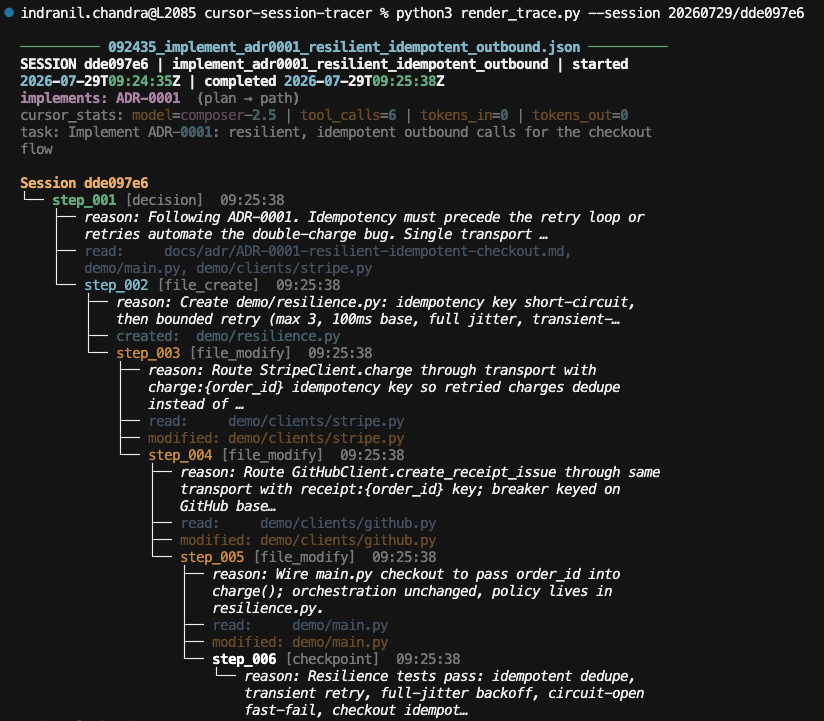</td>
    <td valign="top">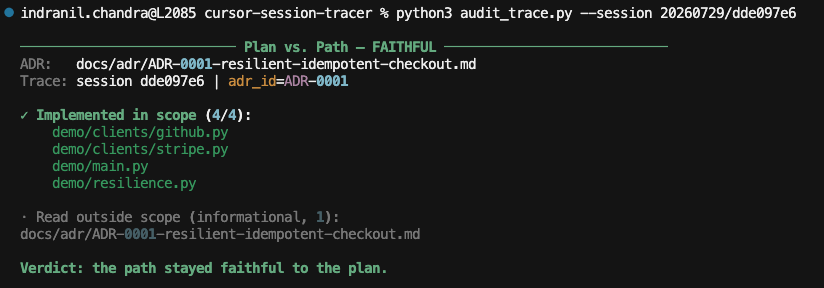</td>
  </tr>
</table>

<sub>Left: the agent's reasoning chain, rendered from the trace. Right: the audit confirming every file it touched was in the ADR's plan. Both from the committed sample <code>20260729/dde097e6</code> — reproduce with no Cursor session required.</sub>

---

## At a glance

| | |
| --- | --- |
| **Problem** | Agentic sessions leave code but no reasoning trail; `docs/` drifts from code |
| **Plan** | ADR from an adversarial review council → [`docs/adr/`](docs/adr/) |
| **Path** | Real-time trace via MCP → `.cursor/traces/` |
| **Check** | `audit_trace.py` flags **LLD drift** (files changed outside the ADR scope) |
| **Try offline** | Committed sample session `20260729/dde097e6` — no Cursor session required |

**Documentation:** [DEMO-RUNBOOK.md](DEMO-RUNBOOK.md) (presenter commands) · [DESIGN-PLAN.md](DESIGN-PLAN.md) (talk + architecture) · [docs/adr/README.md](docs/adr/README.md) (ADR model)

---

## Table of contents

- [Why](#why)
- [The two-artifact model: plan vs. path](#the-two-artifact-model-plan-vs-path)
- [Quickstart](#quickstart)
- [How the tracer works](#how-the-tracer-works)
- [Wire it into Cursor](#wire-it-into-cursor)
- [The live demo](#the-live-demo)
- [Screenshots](#screenshots)
- [Rendering & auditing traces](#rendering--auditing-traces)
- [Testing](#testing)
- [Roadmap / future scope](#roadmap--future-scope)
- [Project structure](#project-structure)
- [Contributing](#contributing)
- [License](#license)

---

## Why

Agentic coding is a new execution model, and it broke an assumption: that the person who wrote the code can explain it. When an agent reads 20 files and rewrites 40 in one session, it leaves the output and nothing else — no PR description written along the way, no Slack thread, no reasoning. We call this **agentic amnesia**. Forty-eight hours later, when something breaks, git bisect points you at the agentic commit and the diff is a wall of noise.

The existing tools answer different questions:

| Tool | Answers |
| --- | --- |
| Git history | *What* changed, when, by whom |
| Step debugger | What is executing *right now* |
| Unit test failure | Which assertion broke, on which input |
| **Agentic session trace** | **Why** did the agent make *this* decision, given what it had read, at that point in the session |

The fourth question is new. This project is a working answer to it.

---

## The two-artifact model: plan vs. path

On long-lived brownfield projects the `docs/` folder is written once and never kept honest — the code moves on, the docs don't. The fix isn't more discipline; it's making the record a **byproduct of the work** at two moments:

| Artifact | Produced | By | Answers | Lives in |
| --- | --- | --- | --- | --- |
| **ADR** — the *plan* | *before* implementation | [`review-council`](.cursor/commands/design-review.md): an adversarial review by 3–6 expert personas | *What did we decide, and why?* | [`docs/adr/`](docs/adr/) |
| **Trace** — the *path* | *during* implementation | the three MCP tools below | *What did the agent actually do?* | `.cursor/traces/` |

HLD already has a home for its "why" — the ADR. The **LLD layer has had none**: what happened inside a module, why a function was refactored, what the agent decided mid-session. The trace is that missing LLD record, and `adr_id` ties it back to the plan. The loop:

```
  /design-review            start_trace(adr_id=…)          audit_trace.py
 ┌──────────────┐  ADR    ┌──────────────────┐  trace   ┌──────────────────┐
 │ adversarial   │ ─────▶ │ implement with    │ ───────▶ │ plan vs. path:    │
 │ review council│  plan   │ the tracer running │  path    │ flag LLD drift    │
 └──────────────┘         └──────────────────┘          └──────────────────┘
```

A PR then ships as **code + ADR + trace** — and the reviewer, human or agent, gets the full context instead of reverse-engineering intent from the diff. See [`docs/adr/README.md`](docs/adr/README.md) for the full model.

---

## Quickstart

**Requires:** Python 3.12 · [Cursor](https://cursor.com) 0.43+ (MCP) · Cursor 1.6+ (`/design-review` command) · [Homebrew](https://brew.sh) on macOS for demo tools (`glow`, `watch`, `jq` — installed by `make setup`)

```bash
git clone https://github.com/indranildchandra/cursor-session-tracer
cd cursor-session-tracer

make setup          # venv + deps + glow, watch, jq (Homebrew)
make test
make server         # http://127.0.0.1:8080 — leave running in one terminal
```

On macOS, if `python3.12` isn't on your `PATH`:

```bash
make setup PYTHON=/Library/Frameworks/Python.framework/Versions/3.12/bin/python3
```

<details>
<summary>Prefer raw commands (no <code>make</code>)?</summary>

```bash
python3.12 -m venv .venv && source .venv/bin/activate
pip install -r requirements.txt
brew install glow watch jq
python -m pytest tests/ -q
uvicorn src.app:app --host 127.0.0.1 --port 8080 --reload
```
</details>

### Smoke test (no live Cursor session)

Uses the committed sample trace — works offline after clone:

```bash
curl http://127.0.0.1:8080/health | jq .
python render_trace.py --session 20260729/dde097e6
python audit_trace.py  --session 20260729/dde097e6
python audit_trace.py  --session 20260729/dde097e6 --json | jq .
# expect: FAITHFUL · faithful: true · four files in scope
```

Open this repo in Cursor and confirm **Settings → MCP → cursor-session-tracer** is connected while `make server` runs. Full demo loop: **[DEMO-RUNBOOK.md](DEMO-RUNBOOK.md)**.

---

## How the tracer works

Three MCP tools integrate into Cursor's agentic loop, served by FastMCP mounted on FastAPI:

| Tool | The agent calls it… | What it does |
| --- | --- | --- |
| `start_trace(task, files_in_scope, adr_id="")` | at the start of a multi-file task | creates the trace file, returns a `session_id`; auto-detects model + Cursor session from the local DB; links the ADR if given |
| `append_trace(session_id, type, reason, files_*, parent_step_id)` | before each significant decision | appends an event; auto-increments `tool_call_count`; logs mid-session model switches |
| `end_trace(session_id, outcome)` | when the task completes or stops | writes `ended_at`, `outcome`, and token counts read from Cursor's DB |

Every event carries a `parent_step_id`. That's what makes the trace a **graph, not a log** — the reasoning chain is directional and queryable.

**Cursor usage stats are captured automatically** (no self-reporting): [`src/cursor_db.py`](src/cursor_db.py) reads Cursor's local SQLite DB (`state.vscdb`, resolved per-OS) to populate `composer_id`, `model`, per-event model switches, and `tokens_in` / `tokens_out`. If Cursor isn't installed or the DB is absent, these degrade gracefully to `null` and the trace stays valid.

<details>
<summary>Trace file schema</summary>

Stored at `.cursor/traces/<YYYYMMDD>/<session_id>/<HHMMSS>_<slug>.json`:

```json
{
  "session": {
    "session_id": "dde097e6",
    "slug": "implement_adr0001_resilient_idempotent_outbound",
    "task": "Implement ADR-0001: resilient, idempotent outbound calls for the checkout flow",
    "adr_id": "ADR-0001",
    "started_at": "2026-07-29T09:24:35Z",
    "ended_at": "2026-07-29T09:25:38Z",
    "outcome": "completed",
    "repo_snapshot": ["demo/resilience.py", "demo/clients/stripe.py", "demo/clients/github.py", "demo/main.py"],
    "cursor_stats": {
      "composer_id": "febc6fdd-…",
      "model": "composer-2.5",
      "tool_call_count": 6,
      "tokens_in": 0,
      "tokens_out": 0
    }
  },
  "events": [
    {
      "step_id": "step_003",
      "parent_step_id": "step_002",
      "type": "file_modify",
      "timestamp": "2026-07-29T09:25:38Z",
      "reason": "Route StripeClient.charge through transport with charge:{order_id} idempotency key so retried charges dedupe instead of double-charging.",
      "files_read": ["demo/clients/stripe.py"],
      "files_modified": ["demo/clients/stripe.py"],
      "files_created": [],
      "files_deleted": [],
      "notes": ""
    }
  ]
}
```

Event types: `decision` · `file_read` · `file_modify` · `file_create` · `file_delete` · `tool_call` · `checkpoint`.
</details>

---

## Wire it into Cursor

**1. MCP server.** `.cursor/mcp.json` is committed, so Cursor auto-registers the tracer when you open the project:

```json
{ "mcpServers": { "cursor-session-tracer": { "url": "http://127.0.0.1:8080/mcp" } } }
```
> Cursor 0.43+. Older versions: use `"url": "http://127.0.0.1:8080/sse"`.

**2. Tracing rule.** `.cursor/rules/session_trace.mdc` tells the agent when to call the tools (any multi-file or architectural task). It's active automatically.

**3. Adversarial review command** *(requires Cursor 1.6+ — custom commands)*. `.cursor/commands/design-review.md` is the `/design-review` command; Cursor discovers any Markdown file in `.cursor/commands/` and lists it when you type `/` in the agent chat. The 20+ expert personas live in `.cursor/review-council/` (deliberately *outside* `commands/`, so they don't show up as commands); the command reads them by path. See [`.cursor/review-council/README.md`](.cursor/review-council/README.md).

**Installing into another repo:** copy `.cursor/` (the `mcp.json`, `rules/`, `commands/`, and `review-council/` folders) and `docs/adr/TEMPLATE.md` into the target project, and point its `.cursor/mcp.json` at your running tracer.

---

## The live demo

The bundled `demo/` app is a **naive checkout service** with a deliberate, dangerous flaw: `POST /checkout` charges via Stripe then writes a receipt via GitHub, with every call unguarded. It is **not idempotent** — retry a timed-out checkout and the customer is **charged twice**. There's no retry/backoff and no circuit breaker.

That's a decision worth reviewing, not just coding. The demo walks the full loop:

1. **Plan** — `/design-review` on the checkout flow → [**ADR-0001**](docs/adr/ADR-0001-resilient-idempotent-checkout.md) (transcript: [`docs/design-review.md`](docs/design-review.md))
2. **Path** — implement in Cursor with `start_trace(..., adr_id="ADR-0001")`; watch traces land
3. **Check** — `audit_trace.py` verifies scope faithfulness (or flags LLD drift)
4. **Prove** — checkout dedupe test shows the double-charge bug is closed

Step-by-step commands (three-terminal layout, copy-paste appendix): **[DEMO-RUNBOOK.md](DEMO-RUNBOOK.md)**.

Sample session **`20260729/dde097e6`** ships in-repo — use it in the examples below without running a live implement pass.

---

## Screenshots

<details>
<summary>Screenshots from a live ADR-0001 demo run (16 images)</summary>

Captured during a live demo run. Reproduce with **[DEMO-RUNBOOK.md](DEMO-RUNBOOK.md)**.

### Tracer server

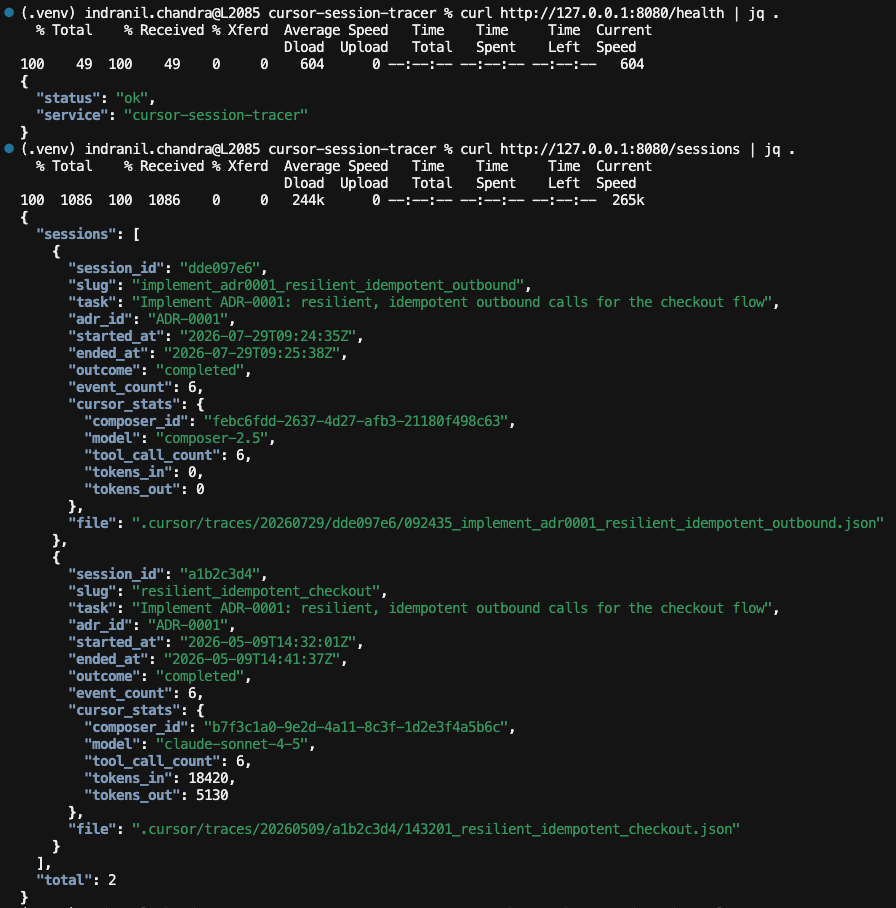

### The double-charge bug

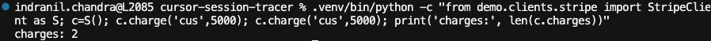

### Plan — adversarial review (`/design-review`)

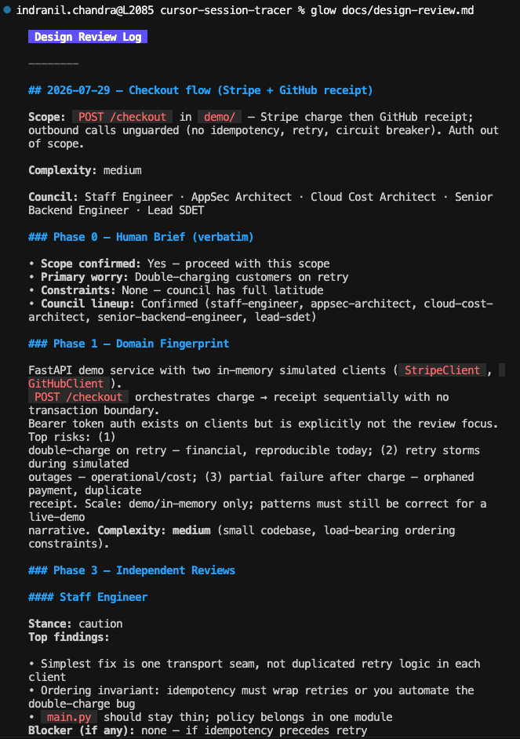

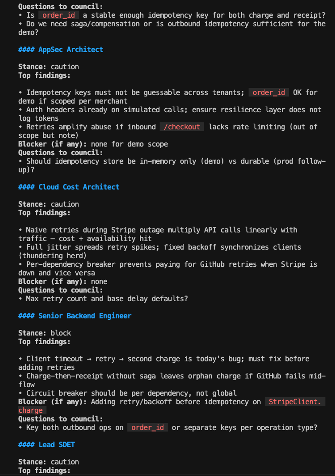

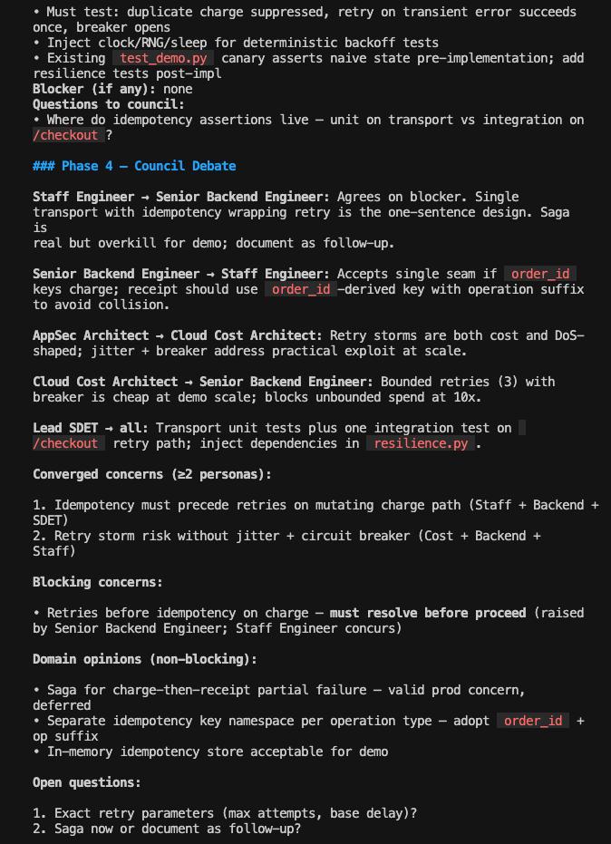

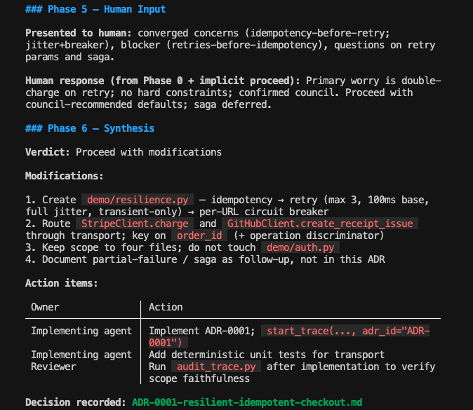

### ADR-0001 — the distilled decision

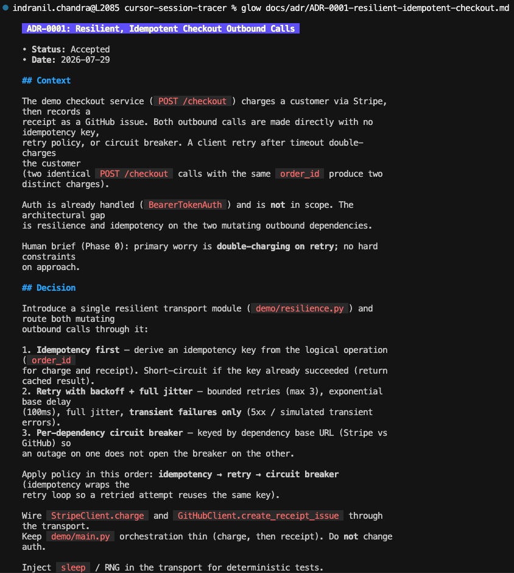

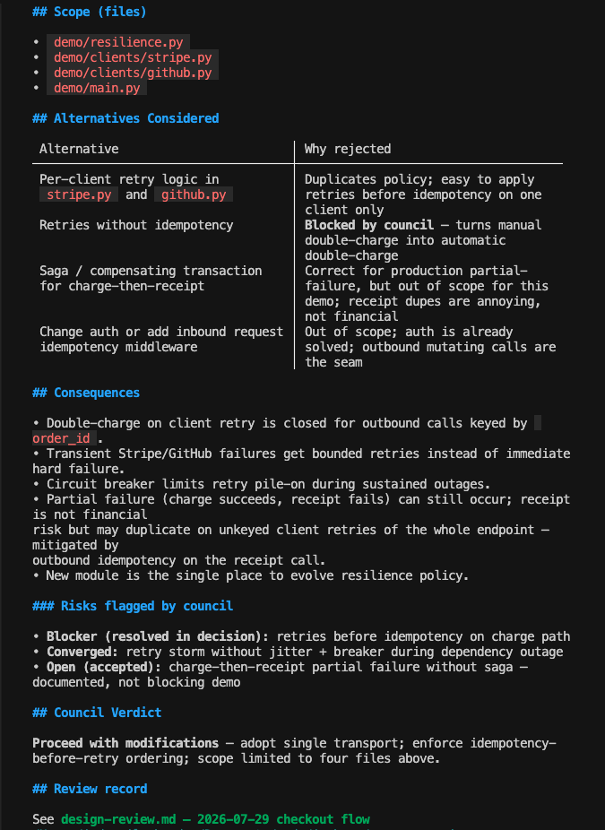

### Path — implement with the tracer running

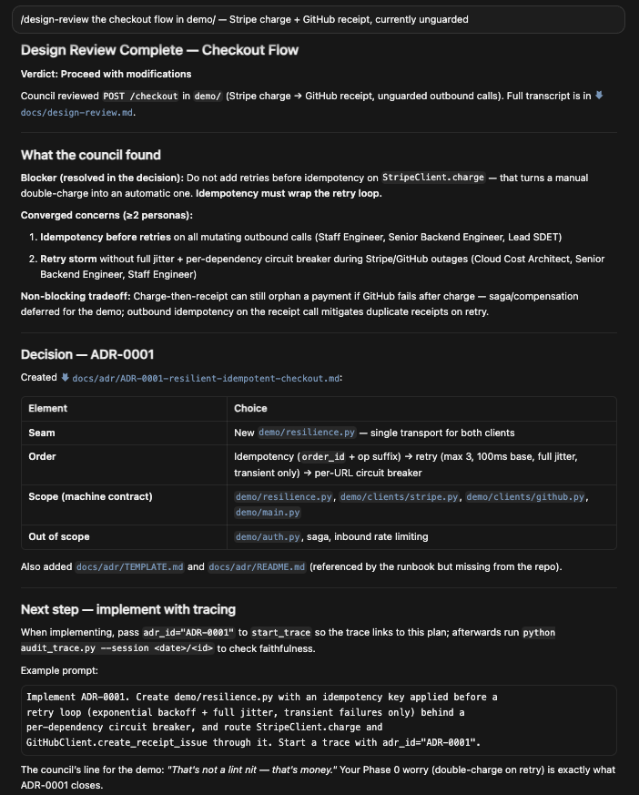

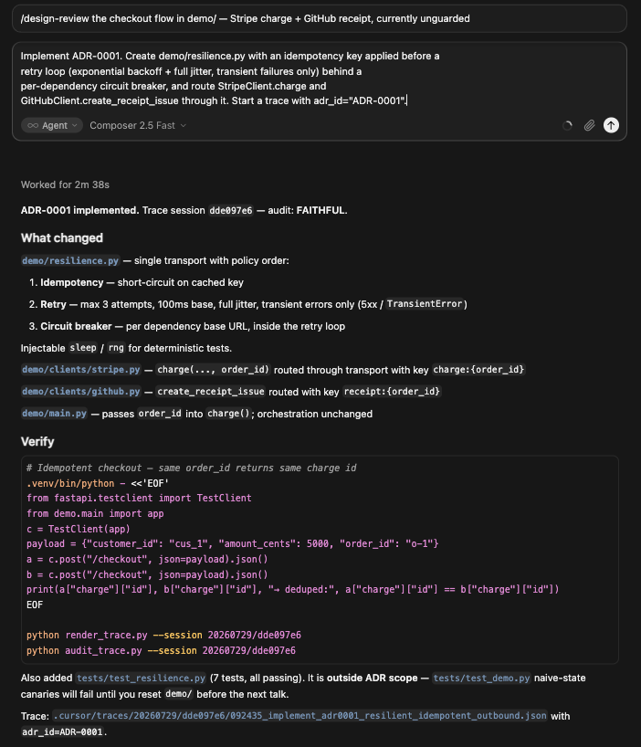

### Render the trace (`render_trace.py`)


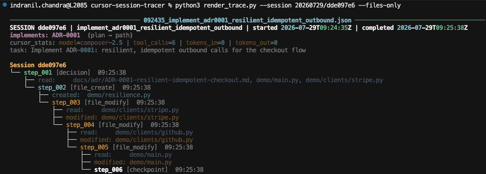

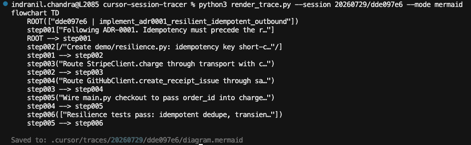

### Check — plan vs. path (`audit_trace.py`)


### After the fix — idempotent checkout

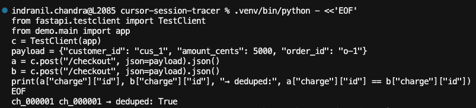

</details>

---

## Rendering & auditing traces

**Render a trace** as a terminal tree or a Mermaid diagram (PR-attachment ready):

```bash
python render_trace.py --session 20260729/dde097e6                 # terminal tree
python render_trace.py --session 20260729/dde097e6 --verbose       # full reason text
python render_trace.py --session 20260729/dde097e6 --files-only    # file touches only
python render_trace.py --session 20260729/dde097e6 --mode mermaid  # → diagram.mermaid
```

**Audit plan vs. path** — the deterministic "independent reviewer". It reads the ADR's `Scope (files)` and diffs it against what the trace actually touched, flagging **LLD drift** (files changed but never planned):

```bash
python audit_trace.py --session 20260729/dde097e6          # resolves the ADR from the trace's adr_id
python audit_trace.py --session 20260729/dde097e6 --json | jq .   # PR-comment / CI gate (exit 1 on drift)
# or: make audit SESSION=20260729/dde097e6
```

The committed sample session is **faithful** to ADR-0001:

```text
──────────────── Plan vs. Path — FAITHFUL ────────────────
✓ Implemented in scope (4/4):  demo/resilience.py, demo/clients/stripe.py,
                               demo/clients/github.py, demo/main.py
Verdict: the path stayed faithful to the plan.
```

When drift occurs, the audit surfaces it explicitly:

```text
──────────────── Plan vs. Path — DRIFT DETECTED ────────────────
✓ Implemented in scope (1/4):  demo/resilience.py
○ Planned but not touched (3): demo/clients/github.py, demo/clients/stripe.py, demo/main.py
✗ LLD DRIFT — changed but not in the ADR (1):
    demo/auth.py  ← reviewer should ask why
```

---

## Testing

```bash
make test        # run the suite            (or: .venv/bin/python -m pytest tests/ -q)
make dev         # install dev/CI tooling    (ruff, pytest-cov)
make cov         # suite + coverage report
make lint        # ruff check .
```

**110 tests, ~94% line coverage, nothing skipped**, validated on **Python 3.12** and enforced in [CI](.github/workflows/ci.yml) on every push/PR (lint + tests + a dogfood step that re-audits the sample trace). Coverage spans the file utilities, all three MCP tools (incl. `adr_id` linking), the cross-platform Cursor-DB reader, the FastAPI endpoints, both renderers (including their CLIs), the plan-vs-path audit (functions **and** CLI), and a canary suite over the demo's starting state — `tests/test_demo.py` fails loudly if `demo/` is left in the post-implementation state before a talk.

The reference solution under [`files-changed post-demo-run/`](files-changed%20post-demo-run/README.md) has its own tests (`test_resilience.py`) for the dedupe / retry / breaker behavior; they run in CI against that self-contained tree and are excluded from the main suite by design (the naive `demo/` has no `resilience.py`).

---

## Roadmap / future scope

**Where this is today:** a working, local, single-developer system. The trace, the ADR
pipeline (`/design-review`), and the plan-vs-path audit all run on your machine against a
flat-file trace store — no server infrastructure, no account, no external dependencies.
That's deliberate: it has to work in one repo on one laptop before it works at org scale.

**Where it goes next** is turning that single-developer loop into a team-scale one — a
shared trace store you can query across sessions, and a CI gate that enforces plan-vs-path
on every PR. Those are the items below, and they're where contributions go furthest:

- **Pluggable graph/analytics trace store (the next logical step).** The JSON schema is deliberately graph-shaped: every event is a node, `parent_step_id` is a directed edge, each file reference is an edge to a file node. The natural evolution is a **pluggable backend** so traces flow into:
  - **Neo4j** — reasoning-graph queries: `(Step)-[:CAUSED]->(Step)`, `(Step)-[:TOUCHED]->(File)`; "which decision patterns precede prod failures", "which files do agents touch most across sessions".
  - **ClickHouse** — columnar analytics across thousands of sessions: agentic-debt trends, token/latency distributions, drift rates per team.

  We'd love contributions here — a `TraceStore` interface with a flat-file default and Neo4j / ClickHouse implementations. Open an issue to coordinate.
- **Per-session cost capture.** Cursor's local DB gives token counts but not dollar cost; deriving `cost_usd` needs a maintained `model → price` map (and per-provider nuances). Dropped for now to avoid a stale price table — **contributions welcome** to add an opt-in pricing map so `cursor_stats` can carry cost.
- **CI integration.** Wire `audit_trace.py --json` into a PR check that comments the plan-vs-path report and gates on LLD drift.
- **Agentic reviewer.** The audit tool supplies the ground-truth planned-vs-actual diff; layer an agent on top to judge *semantic* faithfulness (did the change honor the ADR's intent, not just its file list).

---

## Project structure

```text
cursor-session-tracer/
├── src/
│   ├── file_utils.py            # slug gen, path resolver, JSON read/write
│   ├── cursor_db.py             # reads Cursor's SQLite (state.vscdb), cross-platform
│   ├── mcp_server.py            # FastMCP — start_trace, append_trace, end_trace
│   └── app.py                   # FastAPI app, mounts MCP, exposes /sessions
├── render_trace.py              # terminal tree + Mermaid renderer
├── audit_trace.py               # plan-vs-path: audit a trace against its ADR's scope
├── demo/                        # NAIVE checkout service — the live-demo target
│   ├── auth.py                  # BearerTokenAuth (auth is already solved)
│   ├── main.py                  # POST /checkout — not idempotent (double-charge bug)
│   └── clients/{stripe,github}.py  # unguarded outbound calls
├── docs/
│   ├── adr/                     # Architecture Decision Records — the PLAN half
│   │   ├── README.md            # the plan-vs-path model
│   │   ├── TEMPLATE.md          # ADR template (machine-readable Scope section)
│   │   ├── ADR-0001-resilient-idempotent-checkout.md
│   │   └── ADR-0002-distributed-circuit-breaker.md   # Proposed — follow-up
│   └── design-review.md         # full adversarial-review transcript (ADR-0001's lineage)
├── .cursor/
│   ├── mcp.json                 # Cursor MCP registration (auto-loaded)
│   ├── rules/session_trace.mdc  # rule — tells the agent when to trace
│   ├── commands/design-review.md# the /design-review command
│   ├── review-council/          # adversarial-review personas + protocol
│   └── traces/                  # trace files, written at runtime
│       └── 20260729/dde097e6/   # committed sample trace (ADR-0001 live demo)
├── demo_screenshots/            # screenshots from a live ADR-0001 demo run
│   ├── tracer-health-and-sessions-api.png
│   ├── stripe-double-charge-bug.png
│   ├── design-review-transcript-top.png
│   ├── design-review-council-reviews.png
│   ├── design-review-council-debate.png
│   ├── design-review-synthesis-adr-0001.png
│   ├── adr-0001-resilient-idempotent-checkout.png
│   ├── adr-0001-scope-alternatives-verdict.png
│   ├── cursor-chat-snap-1.png   # design review complete in Cursor chat
│   ├── cursor-chat-snap-2.png   # ADR-0001 implementation summary
│   ├── render-trace-cli-verbose.png
│   ├── render-trace-cli-files-only.png
│   ├── render-trace-cli-mode-mermaid.png
│   ├── audit-trace-faithful-cli.png
│   ├── audit-trace-faithful-cli-json.png   # --json | jq . (CI gate output)
│   └── checkout-idempotency-dedupe-fix-test.png
├── files-changed post-demo-run/ # reference solution the demo produces (own tests)
├── tests/                       # pytest suite (Python 3.12) — 110 tests, ~94% cov
├── .github/workflows/ci.yml     # CI: ruff lint + tests/coverage + dogfood audit
├── Makefile                     # setup / dev / test / cov / lint / server / audit
├── pyproject.toml               # pytest + ruff config
├── requirements.txt             # runtime deps
├── requirements-dev.txt         # + ruff, pytest-cov (CI/lint)
├── .python-version              # 3.12
├── DEMO-RUNBOOK.md              # live-demo guide + quick-reference commands
├── DESIGN-PLAN.md               # talk design + full architecture (v2)
└── CONTRIBUTING.md              # PR checklist + dogfooding guide
```

---

## Contributing

Issues and PRs welcome. See **[CONTRIBUTING.md](CONTRIBUTING.md)** for setup, PR checklist, code conventions, and how to dogfood the plan → path → audit loop on architectural changes.

Quick version:

1. `make test` must pass before you open a PR.
2. Keep `demo/` in the naive starting state unless the PR intentionally changes the demo (`tests/test_demo.py` is the canary).
3. Architectural work: `/design-review` → ADR → implement with tracing → attach `audit_trace.py` output (human + `--json | jq .`) to the PR.

High-impact areas: [Roadmap](#roadmap--future-scope).

## License

[MIT](LICENSE) © Indranil Chandra
